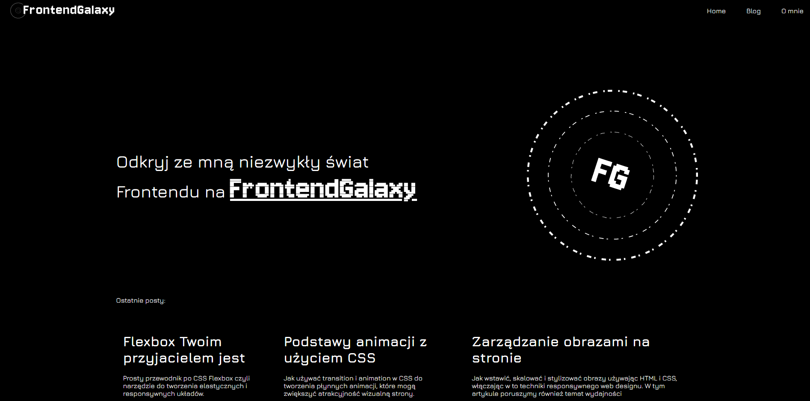

# Frontend Galaxy Blog

## 🚀 About

Welcome to my first bigger project where I am using Astro.js to create my personal blog. The main reason for beginning with this project was creating a place where you can dive into web development stuff and read about my learning path at the same time. On the blog you will find various articles (shorter or longer) from the frontend or web development world in overall.

Website is currently in the building process, so for the moment you can view only a draft version of the project. In the near future I am planning also to add english version of the site.

[Here](https://frontend-galaxy.netlify.app/) you can check the draft version of the Frontend Galaxy blog.

## 🧞 What am I learning?

During the project creation I am trying to get more familiar with Astro.js as well as clear code rule. If it comes to the type of commits I prefer Github Flow convention which sound like a perfect fit in case of such project.

## 👀 Future plans

In the near future I am going implement tests, newsletter form, animations, light/dark mode as well as connecting the blog with the Strapi CMS in order to manage the articles with better and more comfortable way.

## 🤝 Feedback

As I said - this is my first bigger project so feel free to leave any type of feedback - I will be very grateful!
